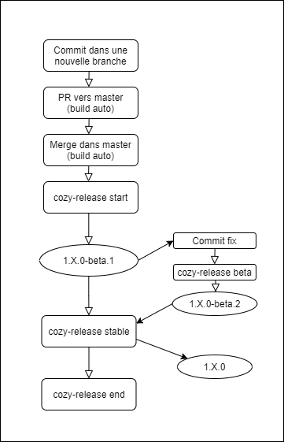

# Cozy Code Guidelines

# Naming of Functions

To name functions, you can use some keywords that everyone will understand, like those ones :

`updateSomething` : should perform server-side updates

`getSomething` : should access data without making a server side call

`fetchSomething` : should access data by making a server side call

`normalizeSomething` : should transform data to conform to a given schema or to make sure that is coherent with other documents

`harmonizeSomething` : should tweak data a bit to work well with other items

# JavaScript

## Return value

Avoid using `undefined` and prefer returning `null`.

> Why ? `undefined` is used for variable that have not been assigned yet. `null` is for a variable with no value.
> See http://www.ecma-international.org/ecma-262/6.0/#sec-undefined-value, http://www.ecma-international.org/ecma-262/6.0/#sec-null-value

## Promises vs async/await

Always use async / await when applicable, instead of Promises and `then()` chains.

> Why ? Cleaner, Clearer, more readable, easier for handling errors
> See https://hackernoon.com/6-reasons-why-javascripts-async-await-blows-promises-away-tutorial-c7ec10518dd9

## Comments

Only comments things that have business logic complexity.

> Why ? Comments are an apology, not a requirement. Good code _mostly_ documents itself.
> See https://github.com/ryanmcdermott/clean-code-javascript#comments

❌ Bad :

```
// Initiate API UserData object, for checkFormLogin token
const req1 = await request({
  url: `https://www.deezer.com/ajax/gw-light.php?method=deezer.getUserData&input=3&api_version=1.0&api_token=&cid=`
})
```

✅ Good

```
function initiateAPIForToken () {
  return request({
    url: `https://www.deezer.com/ajax/gw-light.php?method=deezer.getUserData&input=3&api_version=1.0&api_token=&cid=`
  })
}
```

# React

## Generic code style

```
"eslintConfig": {
    "extends": ["eslint-config-cozy-app"]
  }
```

Let the formatters do their jobs.

## Styling / theming

- Use components from cozy-ui when possible
- When coding a component, try to avoid stylus and prefer material UI's default solutions for theming (withStyles)

See also [cozy-ui guidelines on component development](https://github.com/cozy/cozy-ui/tree/master/docs#guidelines-for-component-development).


# Tests

Unit test files should be located next to their source file, rather then in a subfolder (for example `__tests__`). This keeps them closer to their source file and encourages their maintenance.

:+1: Cool

```
src
├── greetings
│   └── components
│        └── Greeting.jsx
│        └── Greeting.spec.js
```


# Commit messages

A git repository lives with an history that let developers or automatic procedure to find useful information.

They have to look like that:

```
type(optional scope): Subject

optional body

footer with references to issue tracker IDS
```

<details>
    <summary>See more</summary>
<p>

##### Type

One of:

- __feat__: a new feature
- __fix__: a bug fix
- __docs__: changes to documentation
- __style__: formatting, missing semi colons, etc; _no code change_
- __refactor__: refactoring production code; _no behavior change_
- __test__: adding tests, refactoring test; _no production code change_
- __chore__: updating build tasks, package manager configs, etc; _no production code change_

##### Scope

The scope should reflect the part of the codebase that is updated by the
commit. It should be very concise (one or two words).

Example :

feat(Chart): Redraw on data update

Here, the commit is updating the Chart component of the application. We know it
directly from the commit message.

##### Subject

Subjects should be no greater than 50 characters

❌  Bad :

```
fix: When a list contains more than 50 items, the scroll is broken
```

✅  Good

```
fix: A too long list breaks the scrolling
```

Subjects should begin with a capital letter

❌  Bad :

```
fix: a too long list breaks the scrolling
```

✅  Good

```
fix: A too long list breaks the scrolling
```

Subjects do not end with a period.

❌  Bad :

```
fix: A too long list breaks the scrolling.
```

✅  Good

```
fix: A too long list breaks the scrolling
```

Use an imperative tone to describe what a commit does, rather than what it did

❌  Bad :

```
fix: A List that were too large would break the scroll.
```

✅  Good

```
fix: A too long list breaks the scrolling
```

📌 A note about emojis in commit message

You can use emojis in your commit subject but, if so, you should add it after the type.
You can also use emojis in body message anyway you want.

❌  Bad :

```
🚑 fix: A List that were too large would break the scroll.
```

✅  Good

```
fix: A too long list breaks the scrolling 🚑
fix: 🚑 A too long list breaks the scrolling
```

[Suggested Emoji/task relations](https://github.com/slashsBin/styleguide-git-commit-message#suggested-emojis)

##### Body

Not all commits are complex enough to warrant a body, therefore it is optional and only used when a commit requires a bit of explanation and context. Use the body __to explain the what and why of a commit, not the how__.

When writing a body, the __blank line between the title and the body is required__ and you should __limit the length of each line to no more than 72 characters__.

##### Footer

The footer is optional and is used to reference issue tracker IDs.

##### Example
```git
feat: Summarize changes in around 50 characters or less

More detailed explanatory text, if necessary. Wrap it to about 72
characters or so. In some contexts, the first line is treated as the
subject of the commit and the rest of the text as the body. The
blank line separating the summary from the body is critical (unless
you omit the body entirely); various tools like `log`, `shortlog`
and `rebase` can get confused if you run the two together.

Explain the problem that this commit is solving. Focus on why you
are making this change as opposed to how (the code explains that).
Are there side effects or other unintuitive consequenses of this
change? Here's the place to explain them.

Further paragraphs come after blank lines.

 - Bullet points are okay, too

 - Typically a hyphen or asterisk is used for the bullet, preceded
   by a single space, with blank lines in between, but conventions
   vary here

If you use an issue tracker, put references to them at the bottom,
like this:

Resolves: #123
See also: #456, #789
```

</p>
</details>

### Breaking change

Following the [conventional commits](https://www.conventionalcommits.org/en/v1.0.0/), each commit introducing a breaking change must have a `BREAKING CHANGE: description`. The description should contain a migration path, i.e. a way to overcome the change for the apps using the impacted code.

# Travis

## Encrypted variables

All encrypted variables must be set in `.travis.yml` not in the Travis web interface.
They should be preceded by the command to regenerate them. This makes regenerating
the variables easy and all the build information is versionned and peer-reviewed.

When using `travis encrypt` with the `--add` flag, `travis-cli` will reformat the entire `.travis.yml` file and remove all comments. We suggest not using this flag at all.

Example :

```yml
# NPM_TOKEN
# To generate a new key: travis encrypt NPM_TOKEN=<token> -r cozy/cozy-realtime
- secure: WDFj9IULpiNSR6h/i8dtmbm+h4hMAUk8EA8wve9sPrJV1GL5qsMgreMYV7uMx7S93K7h1EoILzS1877tLWJJdQ7f7UgakOUVXb41s0GOfQRznDYivqllYE+X9eUkh8gOBjjCF8G3dW4+w4bbY2X97ZC5hhxwQb3DgKWNdOuGLZXZRVmVNLR0XcEkR8p1CKJe4p/iNwianj2L9Q3wk1QvrBP74lwIJIY0i692fW9SKya/BTWGV+9mgGnR8TkAZUViZT2NygNpYxF4NDcXm1Kv2Y47e9Nr9ekGHuzTcCvT/K3hlpxzjo9VgY4lFvjr5izJ/vTScfB0JuHUs3SQFtrz9yI5DBx4OuUm7iJre2dRfUflJhO4KiCtmbZMh7CnBiMSTWFxPHxiD9kZaDU5EunfCRkWcdeSQTwo5bvscHzha7QNUsdzp/xMvOyhqvmoxXapzxymRzRaYntnvkVCZSJIGzHcc9FhsPRd2AQGyk5uffK4lAOVQ+D+d0WCh+5NagEQSPJ6rymsraJpdvR7OBMXVVAmJs76MnNWCQ3DPozIDkNxTxiWWXC02FZBeKrdnVoSLNUCj4jvdLwi4FmQbi2JNMk5zdOojqtt66LiZ8LtjnHzUXZ2dhfRL0URQm97UVagVmWNkte/6PaS/UeHCr193cwthbSFnanjHDclP0eBjvE=
```

## Deploy

Use the `deploy` section of `travis.yml` instead of `after_success` along with checks on environment variables.

Travis has lots of documentation to easily deploy on npm, github pages, ... you
can find documentation [here](https://docs.travis-ci.com/user/deployment/).

If you want use a specific command use [script](https://docs.travis-ci.com/user/deployment/script/),
but avoid environement variable checks in `after_success`.

❌  Bad :

```
after_success:
- test $TRAVIS_BRANCH = "master" && test $TRAVIS_REPO_SLUG = "cozy/cozy-realtime" && test $TRAVIS_PULL_REQUEST = "false" && yarn travis-deploy-once "yarn semantic-release"
```

✅  Good

```
deploy:
- provider: script
  skip_cleanup: true
  script: yarn travis-deploy-once "yarn semantic-release"
  on:
    branch: master
    repo: cozy/cozy-realtime
```

# Release process



You can find more information about the recommended workflow [here](https://github.com/cozy/cozy-libs/tree/master/packages/cozy-app-publish#recommended-workflow)

# Cozy Logo


## What is Cozy?


[Cozy](http://cozy.io) is a platform that brings all your web services in the
same private space.  With it, your web apps and your devices can share data
easily, providing you with a new experience. You can install Cozy on your own
hardware where no one profiles you.

## Community

You can reach the Cozy Community by:

* Chatting with us on IRC [#cozycloud on Libera.Chat][libera]
* Posting on our [Forum](https://forum.cozy.io)
* Posting issues on the [Github repos](https://github.com/cozy/)
* Mentioning us on [Twitter](http://twitter.com/mycozycloud)

[transform-class-properties]: https://babeljs.io/docs/plugins/transform-class-properties/
